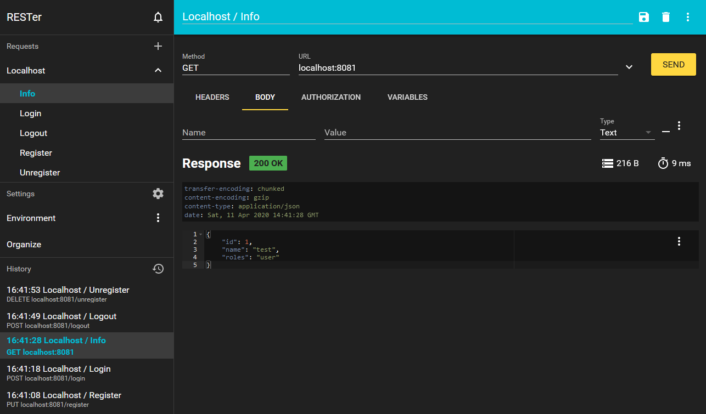
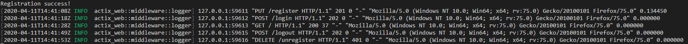

# rust-webservice
A simple webservice in rust. Covers security by cookie identity, communicates by REST in JSON format and uses an embedded SQLite database to store data.

## Build
Execute `cargo run --release` in project root directory to build and run this binary application.

## Enhancements (for production)
* Replace **SQLite** by a proper SQL server (f.e. [postgres](https://crates.io/crates/postgres)) and add a connection pool (f.e. [r2d2](https://crates.io/crates/r2d2)) + an ORM framework (f.e. [Diesel](https://crates.io/crates/diesel)).
* Replace **env_logger** by a more powerful logger (f.e. [slog](https://crates.io/crates/slog)).
* Update **security** by target infrastructure (f.e. [JWT](https://crates.io/crates/jsonwebtoken) + [CORS](https://crates.io/crates/actix-cors)) with password encryption (f.e. [bcrypt](https://crates.io/crates/bcrypt)).

## Screenshots

---
